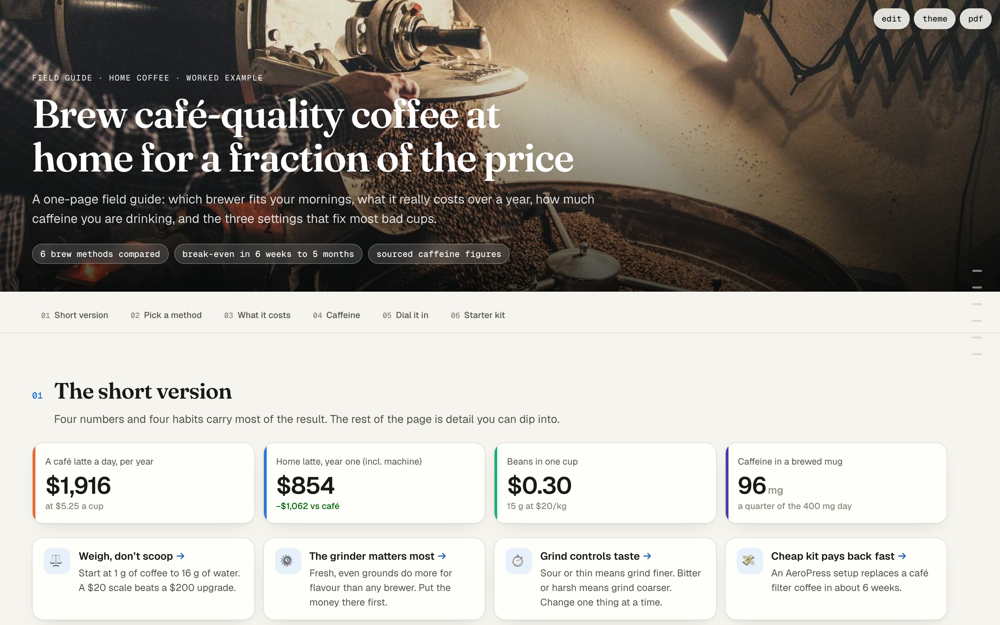
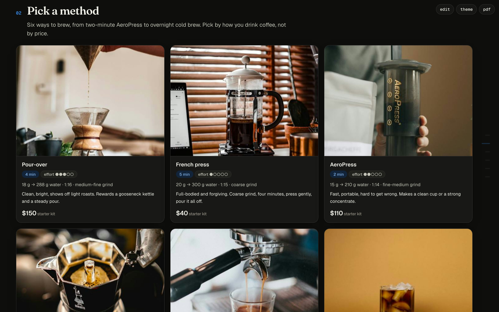
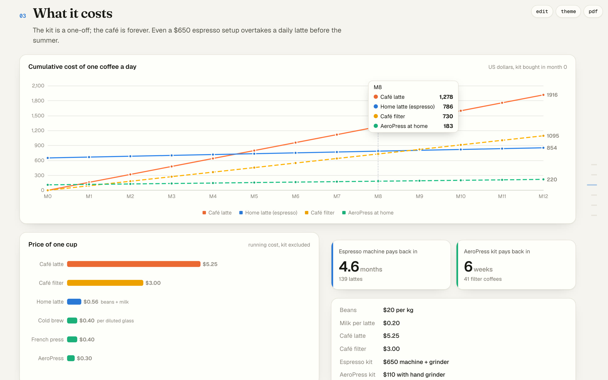
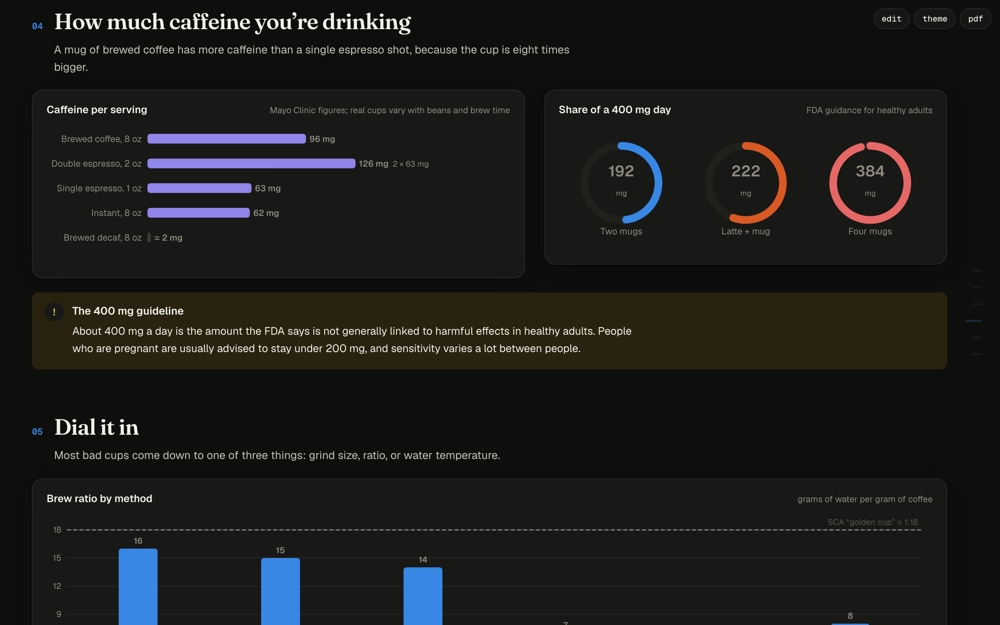
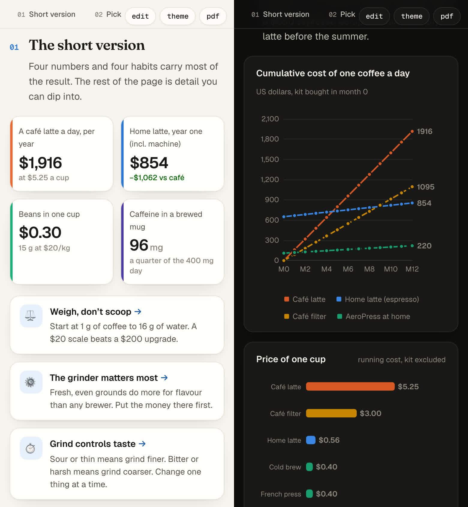

# field-guide

**A Claude Code / agent skill that turns research into a polished, single-file HTML page, then checks its own work in a real browser before handing it over.**



LLMs can already write HTML. What usually goes wrong is the last 10%:
- a tooltip that runs off the bottom of the screen,
- chart labels sitting on top of each other,
- a photo three times taller than the chart beside it,
- a toolbar covering the nav on a phone,
- a hero that floats with uneven margins on a wide monitor.

Two house rules the skill enforces:
- **No bare text.** Body copy always sits on a surface: card, callout, alert, table or chart.
- **Clickable bullets are clickable whole.** If a bullet points somewhere, the entire item is the link (hover state, arrow). Follow-along steps tick off when tapped.

This skill gives the model:

1. **A design system.** Editorial type, a colour-blind-checked chart palette, real light and dark themes, CSS-only motion, print/PDF styles.
2. **About 35 Python building blocks**, from `hero`, `stats`, `points`, `icard` and `compare` to interactive **Apache ECharts** charts (`line`, `columns`, `hbars`, `donut`, `rings`). Hover tooltips, legends and dark mode come for free.
3. **A self-verifier** (`verify.mjs`) that renders the page in headless Chromium at 5 widths × 2 themes and fails on what a human reviewer would notice. It saves screenshots so the model has to look at them too.

The output is **one `.html` file** you can email, drop in a repo, host anywhere or print to PDF.

## Worked example: *Brewing coffee at home*

[`examples/coffee/`](examples/coffee/) is a full researched guide built with the skill. It covers six brew methods, a 12-month cost model, caffeine per serving (Mayo Clinic, FDA) and brewing standards (SCA). Open [`coffee-at-home.html`](examples/coffee/coffee-at-home.html) in a browser, or rebuild it with `python3 examples/coffee/build.py`.

| | |
|---|---|
|  |  |
| **Picture-led cards**, rows that always fill (dark theme) | **Interactive charts.** Tooltips stay on-screen and off the cursor |
|  |  |
| Ranked bars, gauges, callouts | Phone layout: stacked tiles, sticky section pills, readable charts |

Prices in the example are labelled illustrative assumptions. Photos are from Unsplash (free licence, credited in the page footer).

## What the verifier checks

```
node skills/field-guide/scripts/verify.mjs page.html --shots shots/
```

| Area | Fails on |
|---|---|
| layout | sideways page scroll · overlapping text lines · text/controls clipped by `overflow:hidden` |
| rhythm | blocks touching (WARN on double gaps) |
| charts | chart not rendered · labels colliding · labels cut off at the chart edge |
| **hover** | every chart hovered on its actual data marks, scrolled to the **top** and the **bottom** of the viewport. The tooltip must appear, stay fully on-screen, not cover the cursor, not hide under the sticky nav or toolbar, and not say `undefined`/`NaN` |
| chrome | hero or nav not full-bleed · toolbar over the hero or over the sticky nav once scrolled · rail over content · anchor jumps hiding headings |
| media | broken images, missing alt (WARN: stretched, tiny or oversized images) |
| balance | WARN: side-by-side columns ending far apart, or a grid's last row ≤ half full |
| surfaces | **bare text straight on the page**: body text must sit on a card, callout, table, chart or other surface |
| clicks | looks clickable but isn't · **only part of a bullet is a link** · `#anchor` links to nothing (WARN: targets < 24 px) |
| other | page/console errors (WARN: contrast < 3:1, skipped heading levels) |

Every check exists because it caught a real bug in a real generated page. A full run takes about 10 minutes (every chart is hovered at every width); `--quick` runs 390 px and 1512 px only, in about 2.

## Install

```bash
git clone https://github.com/philipsolo/field-guide
cp -r field-guide/skills/field-guide ~/.claude/skills/          # Claude Code: personal skill
# or, per project: cp -r field-guide/skills/field-guide .claude/skills/

cd field-guide && npm install && npx playwright install chromium  # for the verifier
pip install pillow                                              # optional: image resizing (falls back to macOS sips)
```

Then ask your agent something like *"research X and make me a field guide page"*. The skill triggers on requests for a shareable doc, report, guide or explainer.

## Use it directly from Python

```python
import sys; sys.path.insert(0, 'skills/field-guide')
from docprims import *

body  = hero('Title', 'One-sentence lede.', 'Kicker · topic', ['fact one', 'fact two'])
body += toc([('a', 'Overview'), ('b', 'Detail')])
body += section('a', 1, 'Overview', stats([dict(label='Users', value='48k', delta='+12%', dir='up')]) +
                line(['Jan', 'Feb', 'Mar'], [('Visits', [120, 150, 170])], 'Visits', 'thousands'))
body += section('b', 2, 'Detail', table(['Item', 'Value'], [['A', '1'], ['B', '2']], num={1}))
page('My page', body, out='my-page.html', kind='research', description='…')
```

`python3 skills/field-guide/docprims.py --gallery gallery.html` renders every primitive ([`examples/gallery.html`](examples/gallery.html)).

## Layout

```
skills/field-guide/
  SKILL.md            instructions the agent follows (workflow, design rules, verify loop)
  docprims.py         the building blocks
  template.html       tokens, CSS, chart renderer, toolbar, section rail
  scripts/verify.mjs  the self-verifier
examples/coffee/      worked example: generator, photos, output
scripts/readme-shots.mjs  regenerates the screenshots above
```

## Licence

MIT, see [LICENSE](LICENSE). Example photos are from [Unsplash](https://unsplash.com/license) and stay under the Unsplash licence. Fonts (Fraunces, Geist) load from Google Fonts under the SIL OFL. Apache ECharts loads from jsDelivr under Apache-2.0.
